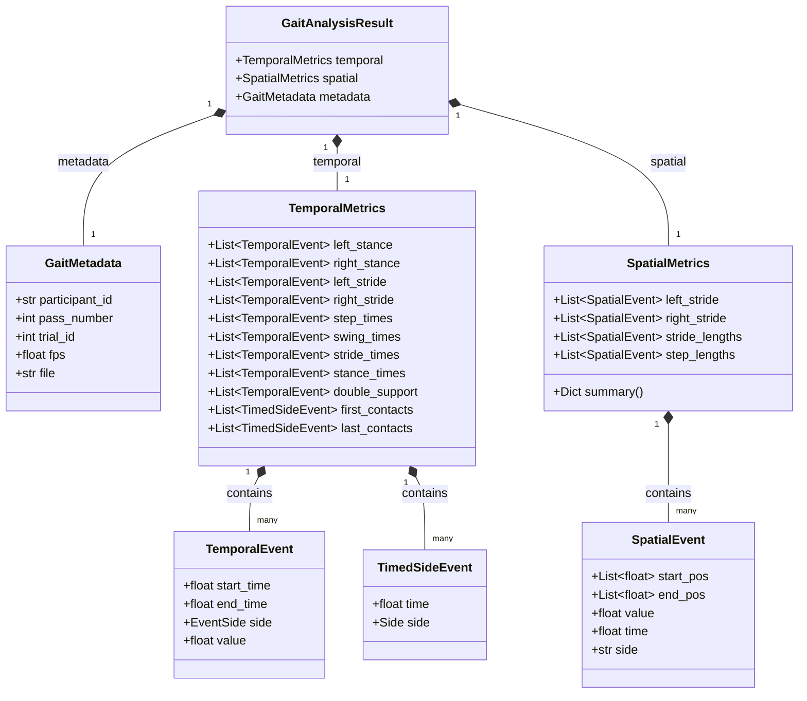

# Gait Results Dataclass Format

This document describes the standardized data format used to represent gait analysis results throughout the pipeline. Both **pipeline-extracted gait metrics** and **converted GAITRite ground truth results** are represented in this format, which is what allows them to be directly compared during the evaluation step.

The format is implemented using [Pydantic](https://docs.pydantic.dev/) `BaseModel` classes for validation.

## Overview

A single gait analysis result — one trial/pass for one participant — is represented by a `GaitAnalysisResult` object, made up of four components:

- **`metadata`** — context about the recording (participant, pass, trial, fps, source file).
- **`temporal`** — timing-based gait metrics (e.g. stance time, swing time).
- **`spatial`** — distance-based gait metrics (e.g. step length, stride length).




## `GaitMetadata`

Describes the context of a single gait recording/session.

| Field | Type | Required | Constraints | Description |
|---|---|---|---|---|
| `participant_id` | `str` | Yes | — | Unique identifier for the participant |
| `pass_number` | `int` | Yes | `>= 1` | Sequential pass number within the session |
| `trial_id` | `Optional[int]` | No | — | Optional trial identifier |
| `fps` | `Optional[float]` | No | `> 0` | Frame rate of the source recording |
| `file` | `Optional[str]` | No | — | Source file name or path |

## `TemporalMetrics`

Timing-based gait metrics, expressed in seconds. Each metric is stored as a **list of per-event/per-stride entries** (`TemporalEvent` or `TimedSideEvent`), not a single summary value — a full per-stride distribution is preserved rather than only a trial-level average.

### `TemporalEvent`

Represents a single temporal gait interval (e.g. one stance phase, one stride).

| Field | Type | Required | Constraints | Description |
|---|---|---|---|---|
| `start_time` | `float` | Yes | `>= 0` | Start time of the interval (seconds) |
| `end_time` | `float` | Yes | `>= 0` | End time of the interval (seconds) |
| `side` | `EventSide` (`"left"` \| `"right"` \| `"bilateral"`) | Yes | — | Limb side the event belongs to |
| `value` | `float` | Yes | `>= 0` | Duration of the event (seconds) |

### `TimedSideEvent`

A single timestamp tied to a limb side — used for traceability of raw contact events.

| Field | Type | Required | Constraints | Description |
|---|---|---|---|---|
| `time` | `float` | Yes | `>= 0` | Timestamp (seconds) |
| `side` | `Side` (`"left"` \| `"right"`) | Yes | — | Limb side |

### `TemporalMetrics` fields

| Field | Type | Description |
|---|---|---|
| `left_stance` | `List[TemporalEvent]` | Stance-phase intervals, left foot |
| `right_stance` | `List[TemporalEvent]` | Stance-phase intervals, right foot |
| `left_stride` | `List[TemporalEvent]` | Stride intervals, left foot |
| `right_stride` | `List[TemporalEvent]` | Stride intervals, right foot |
| `step_times` | `List[TemporalEvent]` | Step time intervals (between opposite-foot contacts) |
| `swing_times` | `List[TemporalEvent]` | Swing-phase intervals |
| `stride_times` | `List[TemporalEvent]` | Combined left + right stride intervals |
| `stance_times` | `List[TemporalEvent]` | Combined stance phases from both feet (defaults to empty) |
| `double_support` | `List[TemporalEvent]` | Intervals where both feet are simultaneously in stance (defaults to empty) |
| `first_contacts` | `List[TimedSideEvent]` | Raw first-contact (heel strike) timestamps, per side |
| `last_contacts` | `List[TimedSideEvent]` | Raw last-contact (toe-off) timestamps, per side |

## `SpatialMetrics`

Distance-based gait metrics, typically expressed as height-normalized ratios. Like `TemporalMetrics`, each metric is a **list of per-event entries** (`SpatialEvent`), preserving the full per-stride/per-step distribution.

### `SpatialEvent`

Represents a single spatial gait measurement (a step or a stride).

| Field | Type | Required | Description |
|---|---|---|---|
| `start_pos` | `List[float]` | Yes | `[x, y]` coordinates at the start of the event |
| `end_pos` | `List[float]` | Yes | `[x, y]` coordinates at the end of the event |
| `value` | `float` | Yes | Calculated distance (e.g. Euclidean norm between `start_pos` and `end_pos`) |
| `time` | `float` | Yes | Timestamp of completion (seconds) |
| `side` | `str` (`"left"` \| `"right"` \| `"bilateral"`) | Yes | Limb side the event belongs to |

### `SpatialMetrics` fields

| Field | Type | Description |
|---|---|---|
| `left_stride` | `List[SpatialEvent]` | Stride-length events, left foot |
| `right_stride` | `List[SpatialEvent]` | Stride-length events, right foot |
| `stride_lengths` | `List[SpatialEvent]` | Combined left + right stride-length events (defaults to empty) |
| `step_lengths` | `List[SpatialEvent]` | Step-length events, combining opposite-foot contacts (defaults to empty) |

### `summary` property

`SpatialMetrics` exposes a computed `summary` property returning statistical summaries (via `get_stats`) for each metric group:

```python
{
    "left_stride": <stats>,
    "right_stride": <stats>,
    "step": <stats>,
    "combined_stride": <stats>,
}
```

## `GaitAnalysisResult`

The top-level container combining all of the above for a single trial/pass.

```python
class GaitAnalysisResult(BaseModel):
    temporal: TemporalMetrics
    spatial: SpatialMetrics
    metadata: GaitMetadata
```

## Example

```json
{
  "metadata": {
    "participant_id": "P01",
    "pass_number": 1,
    "trial_id": 1,
    "fps": 59.92,
    "file": "P01_trial1_pass1.json"
  },
  "temporal": {
    "left_stance": [
      { "start_time": 1.10, "end_time": 1.65, "side": "left", "value": 0.55 }
    ],
    "right_stance": [
      { "start_time": 1.40, "end_time": 1.95, "side": "right", "value": 0.55 }
    ],
    "left_stride": [
      { "start_time": 1.10, "end_time": 2.15, "side": "left", "value": 1.05 }
    ],
    "right_stride": [
      { "start_time": 1.40, "end_time": 2.45, "side": "right", "value": 1.05 }
    ],
    "step_times": [
      { "start_time": 1.10, "end_time": 1.40, "side": "bilateral", "value": 0.30 }
    ],
    "swing_times": [
      { "start_time": 1.65, "end_time": 2.15, "side": "left", "value": 0.50 }
    ],
    "stride_times": [
      { "start_time": 1.10, "end_time": 2.15, "side": "left", "value": 1.05 },
      { "start_time": 1.40, "end_time": 2.45, "side": "right", "value": 1.05 }
    ],
    "stance_times": [],
    "double_support": [],
    "first_contacts": [
      { "time": 1.10, "side": "left" },
      { "time": 1.40, "side": "right" }
    ],
    "last_contacts": [
      { "time": 1.65, "side": "left" },
      { "time": 1.95, "side": "right" }
    ]
  },
  "spatial": {
    "left_stride": [
      {
        "start_pos": [120.5, 300.2],
        "end_pos": [210.8, 298.7],
        "value": 0.72,
        "time": 2.15,
        "side": "left"
      }
    ],
    "right_stride": [
      {
        "start_pos": [130.0, 301.0],
        "end_pos": [220.3, 299.5],
        "value": 0.71,
        "time": 2.45,
        "side": "right"
      }
    ],
    "stride_lengths": [],
    "step_lengths": [
      {
        "start_pos": [120.5, 300.2],
        "end_pos": [130.0, 301.0],
        "value": 0.52,
        "time": 1.40,
        "side": "bilateral"
      }
    ]
  },
}
```

## Usage Notes

- Both pipeline output and converted GAITRite results must conform to this schema for the evaluation step (`GaitEvaluationRunner`) to compare them.
- Pydantic validation enforces required fields and constraints (e.g. `pass_number >= 1`, `fps > 0`) at load/construction time — invalid data will raise a validation error rather than failing silently downstream.
