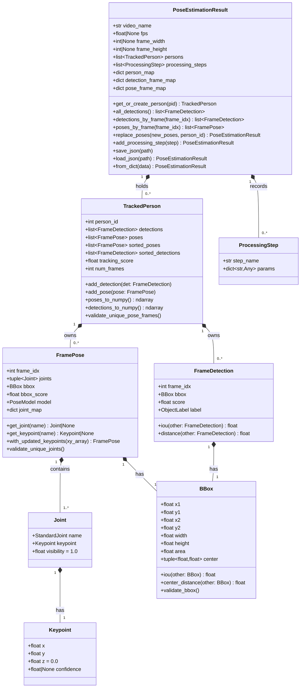
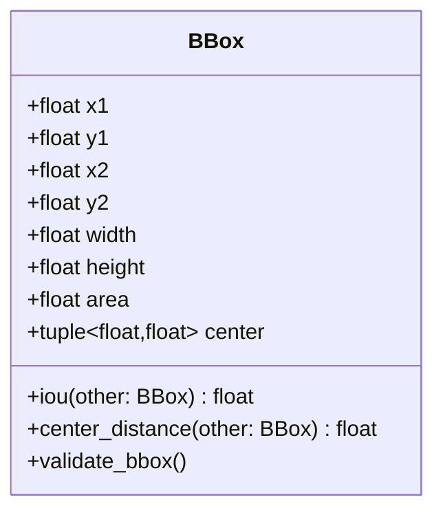
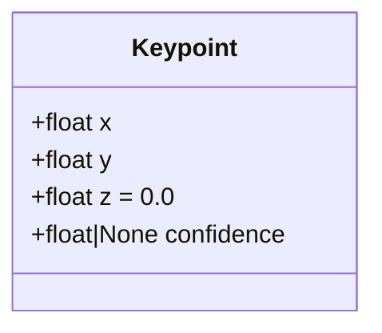
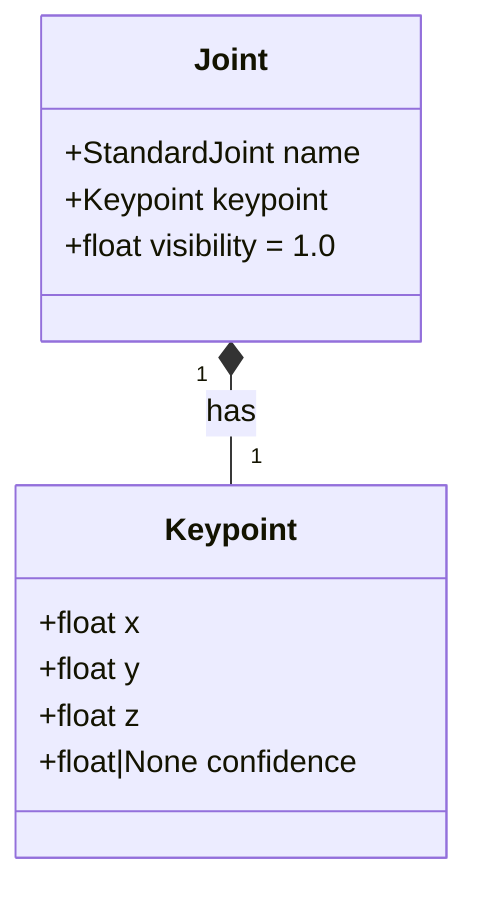
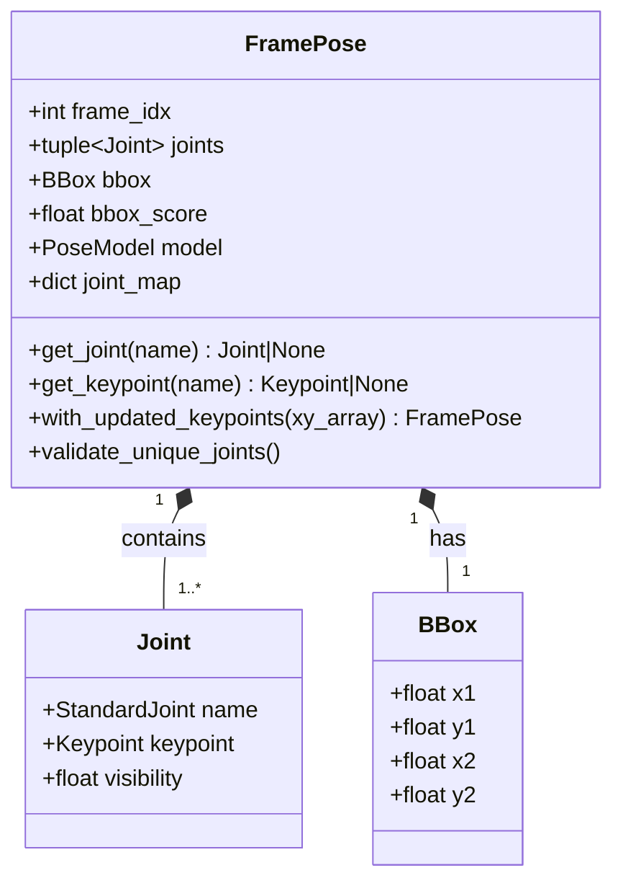
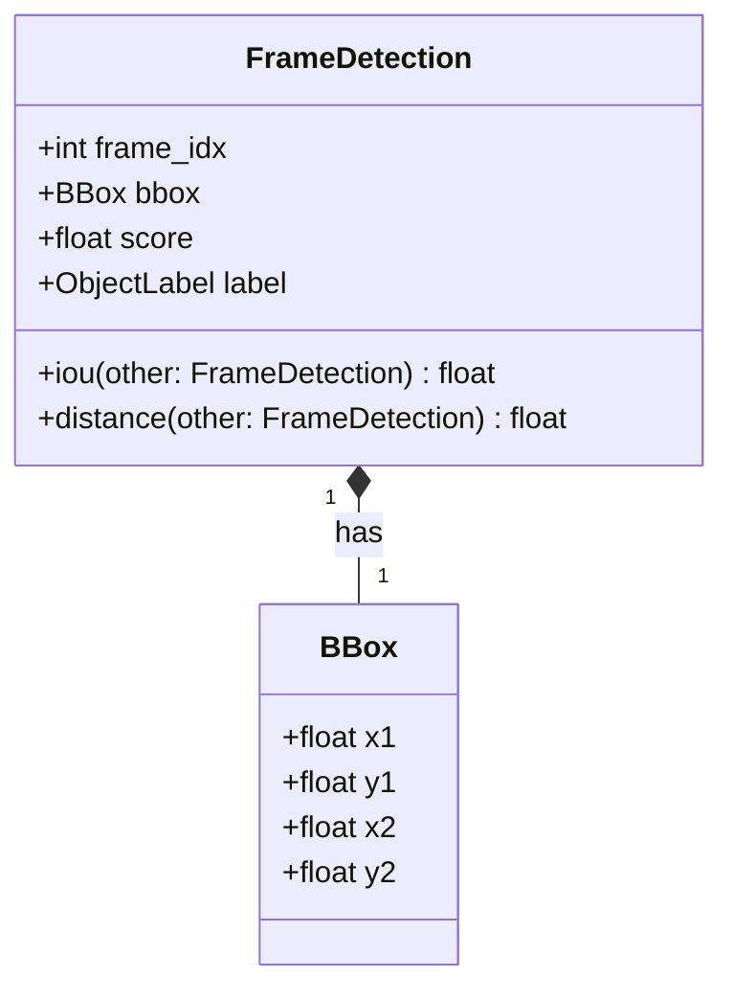
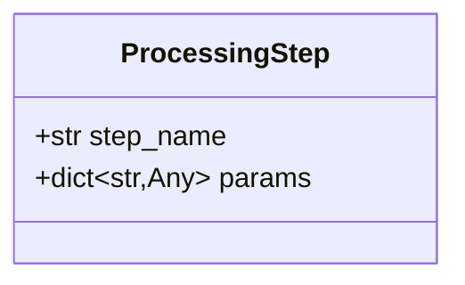
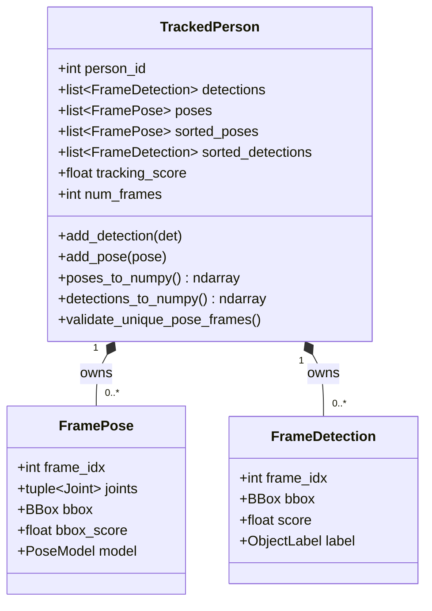
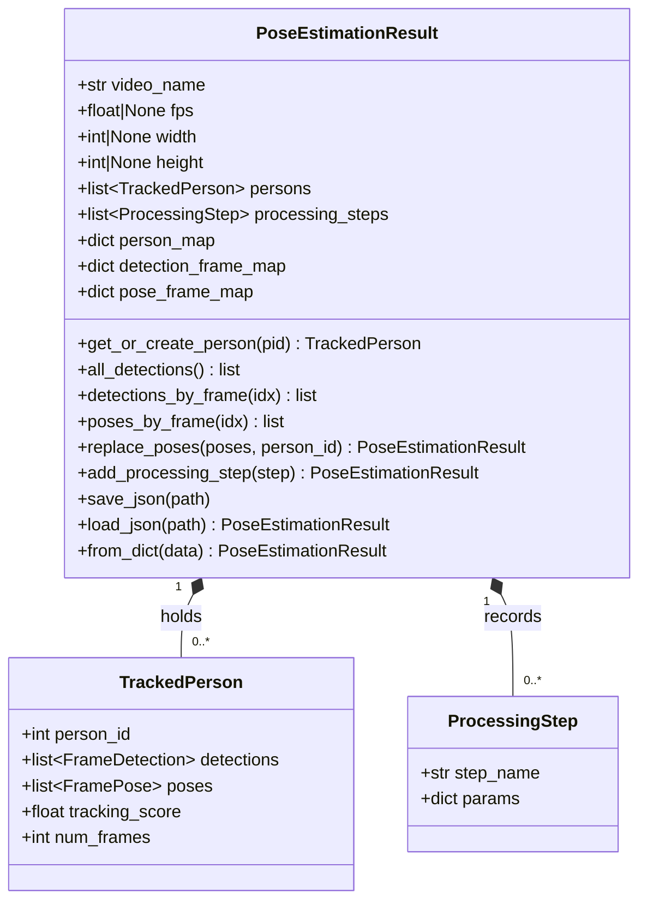
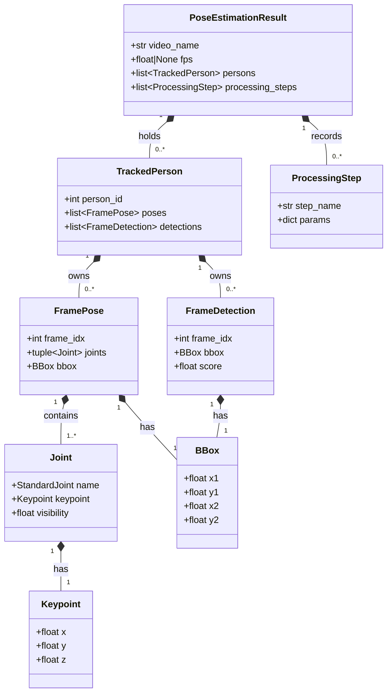

# Pose Estimation Dataclass Format

This document describes the standardized data format used to represent pose estimation output — the format that any pose estimation model's raw output must be converted into before it can be consumed by the [Gait Analysis Pipeline](../../Gait_Analysis_pipeline).

All models are implemented using [Pydantic v2](https://docs.pydantic.dev/) `BaseModel` classes. Immutable models use `ConfigDict(frozen=True)`; mutable models (`TrackedPerson`, `PoseEstimationResult`) are left unfrozen to support incremental construction while processing a video frame-by-frame.

## Overview

The dataclasses form a layered containment hierarchy:

- **Atomic geometric primitives** — `Keypoint`, `BBox`
- **Per-frame snapshots** — `FramePose` (skeleton), `FrameDetection` (bounding box only)
- **Per-person timelines** — `TrackedPerson` (all frames for one tracked individual)
- **Per-video container** — `PoseEstimationResult` (all persons + processing history for one video)

```
PoseEstimationResult
├── persons[] → TrackedPerson
│   ├── poses[] → FramePose
│   │   ├── joints[] → Joint → Keypoint
│   │   └── bbox → BBox
│   └── detections[] → FrameDetection
│       └── bbox → BBox
└── processing_steps[] → ProcessingStep
```

## Full Class Diagram



---

## `BBox`

**Module:** `pose_estimation_dataclasses.bbox_dataclass` · **Base:** `BaseModel` · **Config:** `frozen=True`

An axis-aligned bounding box in pixel coordinates. Used by both `FramePose` and `FrameDetection`.



**Fields**

| Field | Type | Description |
|---|---|---|
| `x1` | `float` | Left edge |
| `y1` | `float` | Top edge |
| `x2` | `float` | Right edge |
| `y2` | `float` | Bottom edge |

**Derived properties**

| Property | Type | Formula |
|---|---|---|
| `width` | `float` | `x2 - x1` |
| `height` | `float` | `y2 - y1` |
| `area` | `float` | `width × height` |
| `center` | `tuple[float, float]` | `((x1+x2)/2, (y1+y2)/2)` |

**Methods**

| Method | Signature | Description |
|---|---|---|
| `iou` | `(other: BBox) → float` | Intersection-over-union with another box; returns `0.0` when no overlap |
| `center_distance` | `(other: BBox) → float` | Euclidean distance between the two centers (`math.hypot`) |

**Validation**

- `validate_bbox` (model validator, `mode="after"`) — raises `ValueError` if `x2 < x1` or `y2 < y1`.

---

## `Keypoint`

**Module:** `pose_estimation_dataclasses.frame_pose_dataclass` · **Base:** `BaseModel`

The 2D (or 3D) position of a single landmark on the body skeleton, plus an optional detection confidence.



| Field | Type | Default | Description |
|---|---|---|---|
| `x` | `float` | — | Horizontal pixel coordinate |
| `y` | `float` | — | Vertical pixel coordinate |
| `z` | `float` | `0.0` | Depth (0 if model is 2D-only) |
| `confidence` | `float \| None` | `None` | Per-keypoint detection score |

---

## `Joint`

**Module:** `pose_estimation_dataclasses.frame_pose_dataclass` · **Base:** `BaseModel`

Pairs a `StandardJoint` enum label with its `Keypoint`, and carries a per-joint visibility score.



| Field | Type | Default | Description |
|---|---|---|---|
| `name` | `StandardJoint` | — | Enum identifying the anatomical joint (e.g. `LEFT_KNEE`) |
| `keypoint` | `Keypoint` | — | Spatial position of this joint |
| `visibility` | `float` | `1.0` | Occlusion score; `1.0` = fully visible |

---

## `FramePose`

**Module:** `pose_estimation_dataclasses.frame_pose_dataclass` · **Base:** `BaseModel`

A complete skeleton snapshot for one person at one frame. Holds a fixed-length tuple of `Joint` objects, a bounding box, and model provenance.



**Fields**

| Field | Type | Description |
|---|---|---|
| `frame_idx` | `int` | Source video frame index |
| `joints` | `tuple[Joint, ...]` | All joints detected in this frame |
| `bbox` | `BBox` | Bounding box around the person |
| `bbox_score` | `float` | Confidence of the bounding box |
| `model` | `PoseModel` | Enum identifying which pose model produced this frame |

**Cached property**

| Property | Type | Description |
|---|---|---|
| `joint_map` | `dict[StandardJoint, Joint]` | O(1) lookup of any joint by name; built once and cached |

**Methods**

| Method | Signature | Description |
|---|---|---|
| `get_joint` | `(name: StandardJoint) → Joint \| None` | Safe joint lookup via `joint_map` |
| `get_keypoint` | `(name: StandardJoint) → Keypoint \| None` | Returns the `Keypoint` for a joint, or `None` if absent |
| `with_updated_keypoints` | `(xy_array: np.ndarray) → FramePose` | Returns a new `FramePose` with all keypoint x/y replaced from an `(N, 2)` array; used after smoothing or filtering |

**Validation**

- `validate_unique_joints` (model validator, `mode="after"`) — raises `ValueError` if two joints share the same `StandardJoint` name.

---

## `FrameDetection`

**Module:** `pose_estimation_dataclasses.frame_detection_dataclass` · **Base:** `BaseModel` · **Config:** `frozen=True`

A single person detection result for one frame — bounding box, confidence, and class label. Independent of skeleton pose; a person can be detected without a full pose estimate.



**Fields**

| Field | Type | Description |
|---|---|---|
| `frame_idx` | `int` | Source video frame index |
| `bbox` | `BBox` | Bounding box of the detected person |
| `score` | `float` | Detection confidence `[0, 1]` |
| `label` | `ObjectLabel` | Enum class label (e.g. `PERSON`) |

**Methods**

| Method | Signature | Description |
|---|---|---|
| `iou` | `(other: FrameDetection) → float` | Delegates to `self.bbox.iou(other.bbox)` |
| `distance` | `(other: FrameDetection) → float` | Delegates to `self.bbox.center_distance(other.bbox)` |

---

## `ProcessingStep`

**Module:** `pose_estimation_dataclasses.processing_steps_dataclass` · **Base:** `BaseModel` · **Config:** `frozen=True`

An immutable audit record for any transformation applied to a pose sequence — filtering, smoothing, normalization, scaling, etc.



| Field | Type | Description |
|---|---|---|
| `step_name` | `str` | Human-readable name of the operation (e.g. `"butterworth_filter"`) |
| `params` | `dict[str, Any]` | All parameters used by that operation (cutoff frequency, window size, etc.) |

> **Design note:** `ProcessingStep` carries no logic. It is a plain record appended to `PoseEstimationResult.processing_steps` by the processor that produced it, providing full reproducibility of the pipeline.

---

## `TrackedPerson`

**Module:** `pose_estimation_dataclasses.tracked_person_dataclass` · **Base:** `BaseModel`

Timeline of all detections and poses for one tracked individual across the full video. **Mutable** — constructed incrementally as frames are processed.



**Fields**

| Field | Type | Default | Description |
|---|---|---|---|
| `person_id` | `int` | — | Unique ID assigned by the tracker |
| `detections` | `list[FrameDetection]` | `[]` | All bounding-box detections across frames |
| `poses` | `list[FramePose]` | `[]` | All skeleton pose snapshots across frames |

**Cached properties**

Both caches are invalidated (popped from `__dict__`) whenever the underlying list is mutated.

| Property | Type | Description |
|---|---|---|
| `sorted_poses` | `list[FramePose]` | Poses ordered by `frame_idx` ascending |
| `sorted_detections` | `list[FrameDetection]` | Detections ordered by `frame_idx` ascending |

**Derived properties**

| Property | Type | Description |
|---|---|---|
| `tracking_score` | `float` | Mean detection confidence across all frames; `0.0` if no detections |
| `num_frames` | `int` | Number of poses stored |

**Methods**

| Method | Signature | Description |
|---|---|---|
| `add_detection` | `(det: FrameDetection)` | Appends a detection and invalidates `sorted_detections` cache |
| `add_pose` | `(pose: FramePose)` | Appends a pose and invalidates `sorted_poses` cache |
| `poses_to_numpy` | `() → np.ndarray` | Returns shape `(frames, joints, 3)` array of `[x, y, z]` per joint per frame; `NaN` for missing joints |
| `detections_to_numpy` | `() → np.ndarray` | Returns shape `(N, 5)` array of `[x1, y1, x2, y2, score]` per detection |

**Validation**

- `validate_unique_pose_frames` (model validator, `mode="after"`) — raises `ValueError` if two poses share the same `frame_idx`.

**numpy export shapes**

- `poses_to_numpy()` → `(num_frames, num_joints, 3)` — axis 0: frame (sorted by `frame_idx`), axis 1: joint (ordered by `StandardJoint` enum), axis 2: `[x, y, z]`
- `detections_to_numpy()` → `(N, 5)` — columns: `[x1, y1, x2, y2, score]`

---

## `PoseEstimationResult`

**Module:** `pose_estimation_dataclasses.pose_estimation_result_dataclass` · **Base:** `BaseModel`

Top-level container for all pose estimation output from a single video recording. Holds all tracked persons, video metadata, and a complete processing history. **This is the format saved to / loaded from the JSON files consumed by the Gait Analysis Pipeline.**



**Fields**

| Field | Type | Default | Description |
|---|---|---|---|
| `video_name` | `str` | — | Source video file name |
| `fps` | `float \| None` | `None` | Frames per second of the recording |
| `width` | `int \| None` | `None` | Frame width in pixels |
| `height` | `int \| None` | `None` | Frame height in pixels |
| `persons` | `list[TrackedPerson]` | `[]` | All tracked individuals |
| `processing_steps` | `list[ProcessingStep]` | `[]` | Ordered audit trail of all transformations |

**Cached lookup maps**

Built lazily and used for O(1) access. Not invalidated automatically — `get_or_create_person` keeps `person_map` synchronized manually.

| Property | Type | Description |
|---|---|---|
| `person_map` | `dict[int, TrackedPerson]` | Index persons by `person_id` |
| `detection_frame_map` | `dict[int, list[FrameDetection]]` | Index all detections (across all persons) by `frame_idx` |
| `pose_frame_map` | `dict[int, list[FramePose]]` | Index all poses (across all persons) by `frame_idx` |

**Methods — person helpers**

| Method | Signature | Description |
|---|---|---|
| `get_or_create_person` | `(pid: int) → TrackedPerson` | Returns existing person or creates and registers a new one |

**Methods — detection / pose helpers**

| Method | Signature | Description |
|---|---|---|
| `all_detections` | `() → list[FrameDetection]` | Flat list of all detections across all persons |
| `detections_by_frame` | `(frame_idx: int) → list[FrameDetection]` | All detections at a given frame (via `detection_frame_map`) |
| `poses_by_frame` | `(frame_idx: int) → list[FramePose]` | All poses at a given frame (via `pose_frame_map`) |

**Methods — immutable update helpers**

Both return a new `PoseEstimationResult` via `model_copy` — the original is not mutated.

| Method | Signature | Description |
|---|---|---|
| `add_processing_step` | `(step: ProcessingStep) → PoseEstimationResult` | Appends one step to the processing history |
| `replace_poses` | `(new_poses: list[FramePose], person_id: int) → PoseEstimationResult` | Replaces the pose list for one person; all other persons are unchanged |

**Methods — serialization**

| Method | Signature | Description |
|---|---|---|
| `save_json` | `(path: str \| Path)` | Writes `model_dump_json(indent=2)` to disk |
| `load_json` | `(path: str \| Path) → PoseEstimationResult` | Reads and validates via `model_validate_json` |
| `from_dict` | `(data: dict) → PoseEstimationResult` | Fast deserialization using `model_construct` (skips validation) |

---

## Relationships Summary



## Enums Referenced

| Enum | Used by | Description |
|---|---|---|
| `StandardJoint` | `Joint.name`, `JOINT_ORDER` | Canonical set of body landmark names (e.g. `LEFT_KNEE`, `RIGHT_ANKLE`) |
| `PoseModel` | `FramePose.model` | Identifies which pose estimation model produced the frame (e.g. `BODY25`, `HALPE`) |
| `ObjectLabel` | `FrameDetection.label` | Detection class label (e.g. `PERSON`) |